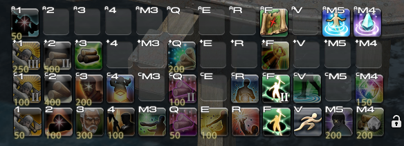
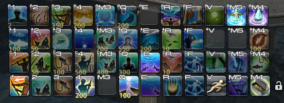
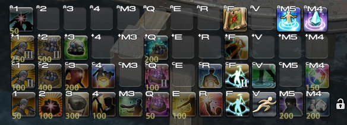
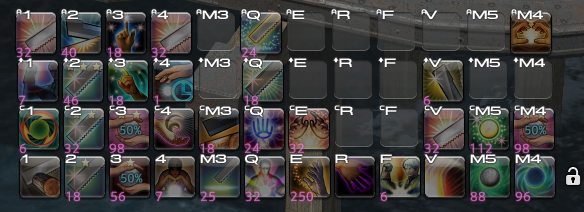

# .xlcore — FFXIV Config Backup (XIVLauncher / Linux)

This repository contains a minimal, version-controlled backup of my FINAL FANTASY XIV configuration when using XIVLauncher on Linux.

## 🔗 Repository
```
git@github.com:Querzion/.xlcore.git
```
---

## 📁 Scope

Only essential configuration files are tracked.

### Global Settings
- ffxivConfig/FFXIV.cfg  
  System settings (graphics, sound, etc.)

### Character Settings
- ffxivConfig/FFXIV_CHR*/  
  - HOTBAR.DAT → hotbars / spell layout  
  - KEYBIND.DAT → keybindings  
  - GEARSET.DAT → gear sets  
  - ADDON.DAT → UI / HUD layout  
  - Macros and other per-character data  

---

# 🎮 FFXIV Job Presets / UI Layouts

This repository also includes configuration references for crafting and gathering jobs.


## 🌿 Disciples of the Land

### FFXIV Actions Keybind - Botanist
```
🟩 [1]
- Bar 1: Field Mastery
- Bar 2: Field Mastery II
- Bar 3: Field Mastery III
- Bar 4: Flora Mastery

🟩 [2]
- Bar 1: Bountiful Harvest
- Bar 2: Blessed Harvest
- Bar 3: Blessed Harvest II
- Bar 4: 

🟩 [3]
- Bar 1: Ageless Words
- Bar 2: Luck of the Pioneer
- Bar 3: Wise to the World
- Bar 4: 

🟩 [4]
- Bar 1: Collector's Focus
- Bar 2: Collect
- Bar 3: 
- Bar 4: 

🟪 [M3]
- Bar 1: Scour
- Bar 2: 
- Bar 3: 
- Bar 4: 

🟪 [Q]
- Bar 1: Pioneer's Gift I
- Bar 2: Pioneer's Gift II
- Bar 3: Nophica’s Tidings
- Bar 4: 

🟪 [E]
- Bar 1: Priming Touch
- Bar 2: 
- Bar 3: 
- Bar 4: 

🟪 [R]
- Bar 1: Brazen Woodsman
- Bar 2: Meticulous Woodsman
- Bar 3: 
- Bar 4: 

🟨 [F]
- Bar 1: Arbor Call
- Bar 2: Arbor Call II
- Bar 3: Truth of Forests
- Bar 4: Triangulate

🟨 [V]
- Bar 1: Sprint
- Bar 2: Sneak
- Bar 3: 
- Bar 4: 

🟦 [M5]
- Bar 1: Scrutiny
- Bar 2: 
- Bar 3: 
- Bar 4: Teleport

🟦 [M4]
- Bar 1: The Giving Land
- Bar 2: The Twelve's Bounty
- Bar 3: 
- Bar 4: Return
```


### FFXIV Actions Keybind - Fisher
```
🟩 [1]
- Bar 1: Cast
- Bar 2: Gig
- Bar 3: Nature’s Bounty
- Bar 4: Big-Game Fishing

🟩 [2]
- Bar 1: Hook
- Bar 2: Precision Hookset
- Bar 3: Powerful Hookset
- Bar 4: Snagging

🟩 [3]
- Bar 1: Mooch
- Bar 2: Mooch II
- Bar 3: Vital Sight
- Bar 4: Identical Cast

🟩 [4]
- Bar 1: Patience
- Bar 2: Patience II
- Bar 3: Salvage
- Bar 4: Prize Catch

🟪 [M3]
- Bar 1:
- Bar 2: Double Hook
- Bar 3: Triple Hook
- Bar 4: Thaliak’s Favor
- 
🟪 [Q]
- Bar 1: Chum
- Bar 2: Baited Breath
- Bar 3: Fish Eyes
- Bar 4: Surface Slap

🟪 [E]
- Bar 1: Release
- Bar 2: Release List
- Bar 3: Veteran Trade
- Bar 4: 

🟪 [R]
- Bar 1: Collect
- Bar 2: Ambitious Lure
- Bar 3: Modest Lure
- Bar 4: Electric Current

🟨 [F]
- Bar 1: Shark Eyes
- Bar 2: Shark Eyes II
- Bar 3: Truth of Oceans
- Bar 4: Fathom

🟨 [V]
- Bar 1: Sprint
- Bar 2: Sneak
- Bar 3: 
- Bar 4: Cast Light

🟦 [M5]
- Bar 1: Rest
- Bar 2: Quit
- Bar 3: 
- Bar 4: Teleport

🟦 [M4]
- Bar 1: Bait
- Bar 2: Makeshift Bait
- Bar 3: Spareful Hand
- Bar 4: Return
```


## FFXIV Actions Keybind - Miner
```
🟩 [1]
- Bar 1: Sharp Vision I
- Bar 2: Sharp Vision II
- Bar 3: Sharp Vision III
- Bar 4: Clear Vision

🟩 [2]
- Bar 1: Bountiful Yield I
- Bar 2: King's Yield I
- Bar 3: King's Yield II
- Bar 4: 

🟩 [3]
- Bar 1: Solid Reason
- Bar 2: Wise to the World
- Bar 3: Luck of the Mountaineer
- Bar 4: 

🟩 [4]
- Bar 1: Collector's Focus
- Bar 2: Collect
- Bar 3: 
- Bar 4:

🟪 [M3]
- Bar 1: Scour
- Bar 2: 
- Bar 3: 
- Bar 4: 

🟪 [Q]
- Bar 1: Mountaineer's Gift I
- Bar 2: Mountaineer's Gift II
- Bar 3: Nald'thal's Tidings
- Bar 4: 

🟪 [E]
- Bar 1: Priming Touch
- Bar 2: 
- Bar 3: 
- Bar 4: 

🟪 [R]
- Bar 1: Brazen Prospector
- Bar 2: Meticulous Prospector
- Bar 3: 
- Bar 4: 

🟨 [F]
- Bar 1: Lay of the Land
- Bar 2: Lay of the Land II
- Bar 3: Truth of Mountains
- Bar 4: Prospect

🟨 [V]
- Bar 1: Sprint
- Bar 2: Sneak
- Bar 3: 
- Bar 4: 

🟦 [M5]
- Bar 1: Scrutiny
- Bar 2: 
- Bar 3: 
- Bar 4: Teleport

🟦 [M4]
- Bar 1: The Giving Land
- Bar 2: The Twelve's Bounty
- Bar 3: 
- Bar 4: Return
```


---

## 🔨 Disciples of the Hand

### FFXIV Actions Keybind - Disciples of the Hand 
- Carpenter
- Blacksmith
- Armorer
- Goldsmith
- Leatherworker
- Weaver
- Alchemist
- Culinarian
```
🟩 [1]
- Bar 1: Basic Synthesis
- Bar 2: Muscle Memory
- Bar 3: Careful Synthesis
- Bar 4: Delicate Synthesis

🟩 [2]
- Bar 1: Basic Touch
- Bar 2: Standard Touch
- Bar 3: Advanced Touch
- Bar 4: Preparatory Touch

🟩 [3]
- Bar 1: Waste Not
- Bar 2: Waste Not II
- Bar 3: Veneration
- Bar 4: Innovation

🟩 [4]
- Bar 1: Observe
- Bar 2: Tricks of the Trade
- Bar 3: Final Appraisal
- Bar 4: Delicate Synthesis

🟪 [M3]
- Bar 1: Prudent Touch
- Bar 2: Groundwork
- Bar 3: 
- Bar 4: 

🟪 [Q]
- Bar 1: Great Strides
- Bar 2: Byregot’s Blessing
- Bar 3: Precise Touch
- Bar 4: Refined Touch

🟪 [E]
- Bar 1: Trained Eye
- Bar 2: Trained Finesse
- Bar 3: 
- Bar 4: 

🟪 [R]
- Bar 1: Hasty Touch
- Bar 2: 
- Bar 3: 
- Bar 4: 

🟨 [F]
- Bar 1: Reflect
- Bar 2: 
- Bar 3: 
- Bar 4: 

🟨 [V]
- Bar 1: Rapid Synthesis
- Bar 2: Delicate Synthesis
- Bar 3: Intensive Synthesis
- Bar 4: Daring Touch

🟦 [M5]
- Bar 1: Master’s Mend
- Bar 2: Immaculate Mend
- Bar 3: 
- Bar 4: 

🟦 [M4]
- Bar 1: Manipulation
- Bar 2: Waste Not II
- Bar 3: 
- Bar 4: Trained Perfection
```



---

## ❌ Excluded

This repository intentionally excludes:

- Account data (accounts.json)
- Dalamud (plugins, cache, runtime)
- Logs and temp files
- Wine/Proton prefixes
- Game installation files
- Screenshots

---

## 🧠 Philosophy

This is a dotfiles-style repo, not a full backup.

**Goal:**  
Recreate UI + gameplay configuration instantly on any machine.

---

## 🚀 Setup

### Option 1 — Fresh Machine (Recommended)

```bash
cd ~
git clone git@github.com:Querzion/.xlcore.git .xlcore
